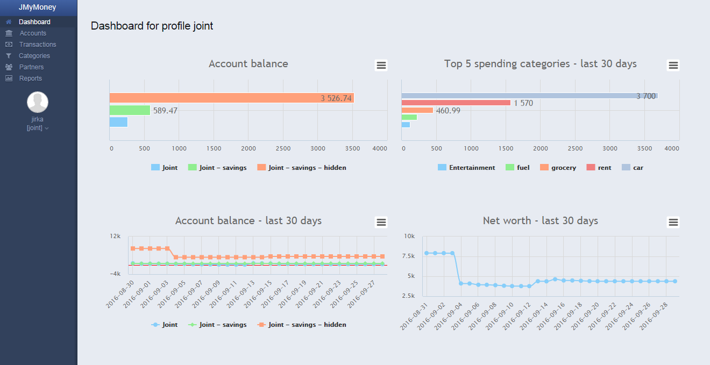
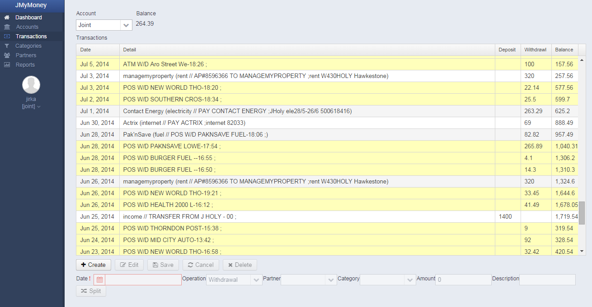

# net.jmymoney

Personal finance manager, inspired by [KMyMoney](https://kmymoney.org/) with the intention to make it online.

##Install instructions:

*	Setup mysql db using <net.jmymoney.core/src/main/sql/db_create.sql> 
*	Create yml file with db connection configuration, e.g.:
	
		swarm:
		datasources:
    		data-sources:
      		MySQLDS:
        		driver-name: mysql
        		connection-url: jdbc:mysql://localhost:3306/jmm
        		user-name: "jmm"
        		password: "secret"
  
>More configuration options can be found here [Wildfly Swarm reference guide](https://reference.wildfly-swarm.io/)
*	Run `java -jar net.jmymoney.core-swarm.jar -s path-to-swarm-config.yml`

##Screenshots: 

Dashboard

Ledger

Reports

